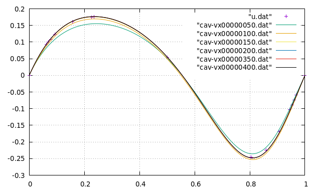

# compressible-fluid

Navier-Stokes equations. Simple fully explicit method.

**Navier-Stokes equations**

$$\frac{\partial \rho \boldsymbol{u}}{\partial t} + \nabla \cdot (\rho \boldsymbol{u} \otimes \boldsymbol{u}) = - \nabla p + \mu \Delta \boldsymbol{u}$$

**Equation of continuity**

$$\frac{\partial \rho}{\partial t} + \nabla \cdot (\rho \boldsymbol{u}) = 0$$

**Equation of state**

Assume a barotropic fluid.

$$\rho = \rho(p)$$

## Discretization method

- FDM
- structured grid
- Advection term
  - 1st order upwind scheme
- diffusion term
  - 2nd order central scheme
- collocated grid
- fully explicit

## TODO

- [ ] collocated grid vs. staggered grid.
- [ ] Stability Analysis.
- [ ] LES, RANS.

## How to run

1. Install C++ compiler, [gnuplot](http://www.gnuplot.info/), [OpenMP](https://www.openmp.org/).

2. `make run`

## Visualization

[](https://www.youtube.com/watch?v=llIm1qXyo4s)

## Re=100

regular_grid results.

601 * 601. 





## Reference (incompressible)

Ghia, U. K. N. G., Kirti N. Ghia, and C. T. Shin. "High-Re solutions for incompressible flow using the Navier-Stokes equations and a multigrid method." Journal of computational physics 48.3 (1982): 387-411.

Re=100

```
1.0000 0.00000
0.9688 -0.05906
0.9609 -0.07391
0.9531 -0.08864
0.9453 -0.10313
0.9063 -0.16914
0.8594 -0.22445
0.8047 -0.24533
0.5000 0.05454
0.2344 0.17527
0.2266 0.17507
0.1563 0.16077
0.0938 0.12317
0.0781 0.10890
0.0703 0.10091
0.0625 0.09233
0.0000 0.00000
```


```
1.0000 1.00000
0.9766 0.84123
0.9688 0.78871
0.9609 0.73722
0.9531 0.68717
0.8516 0.23151
0.7344 0.00332
0.6172 -0.13641
0.5000 -0.20581
0.4531 -0.21090
0.2813 -0.15662
0.1719 -0.10150
0.1016 -0.06434
0.0703 -0.04775
0.0625 -0.04192
0.0547 -0.03717
0.0000 0.00000
```


Re=3200

y
```
1.0000 1.00000
0.9766 0.53236
0.9688 0.48296
0.9609 0.46547
0.9531 0.46101
0.8516 0.34682
0.7344 0.19791
0.6172 0.07156
0.5000 -0.04272
0.4531 -0.086636
0.2813 -0.24427
0.1719 -0.34323
0.1016 -0.41933
0.0703 -0.37827
0.0625 -0.35344
0.0547 -0.32407
0.0000 0.00000
```
x
```
1.0000 0.00000
0.9688 -0.39017
0.9609 -0.47425
0.9531 -0.52357
0.9453 -0.54053
0.9063 -0.44307
0.8594 -0.37401
0.8047 -0.31184
0.5000 0.00999
0.2344 0.28188
0.2266 0.29030
0.1563 0.37119
0.0938 0.42768
0.0781 0.41906
0.0703 0.40917
0.0625 0.39560
0.0000 0.00000
```

Re=10000

y
```
1.0000 1.00000
0.9766 0.47221
0.9688 0.47783
0.9609 0.48070
0.9531 0.47804
0.8516 0.34635
0.7344 0.20673
0.6172 0.08344
0.5000 0.03111
0.4531 -0.07540
0.2813 -0.23186
0.1719 -0.32709
0.1016 -0.38000
0.0703 -0.41657
0.0625 -0.42537
0.0547 -0.42735
0.0000 0.00000
```

x
```
1.0000  0.00000
0.9688  -0.54302
0.9609  -0.52987
0.9531  -0.49099
0.9453  -0.45863
0.9063  -0.41496
0.8594  -0.36737
0.8047  -0.30719
0.5000  0.00831
0.2344  0.27224
0.2266  0.28003
0.1563  0.35070
0.0938  0.41487
0.0781  0.43124
0.0703  0.43733
0.0625  0.43983
0.0000  0.00000
```
